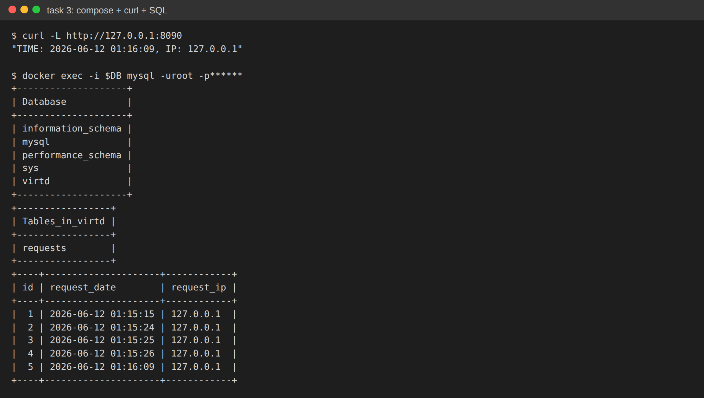
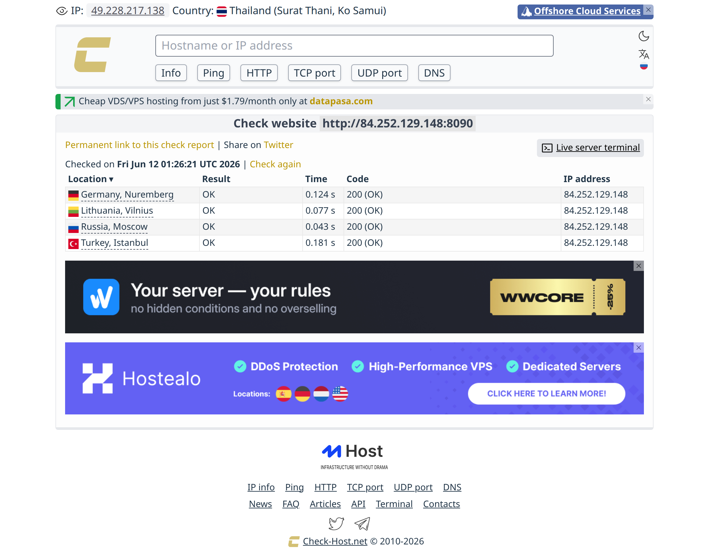
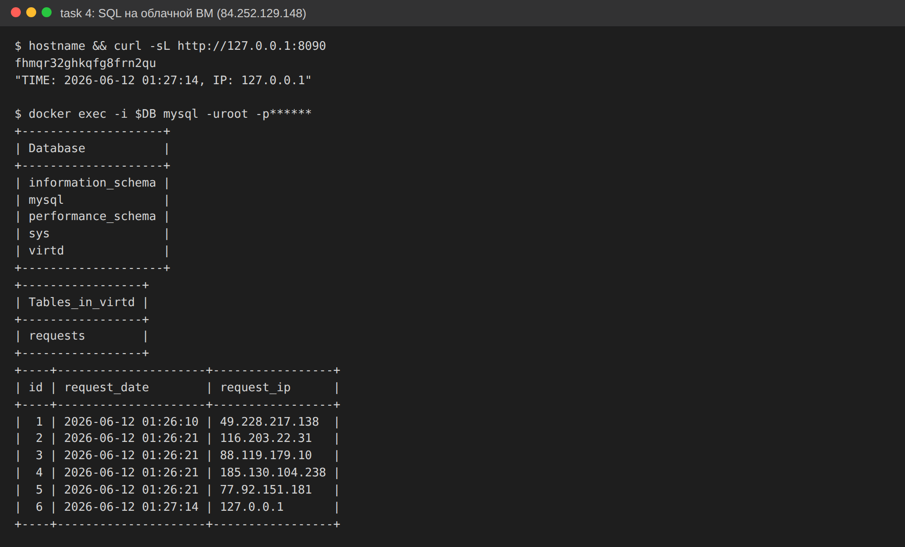
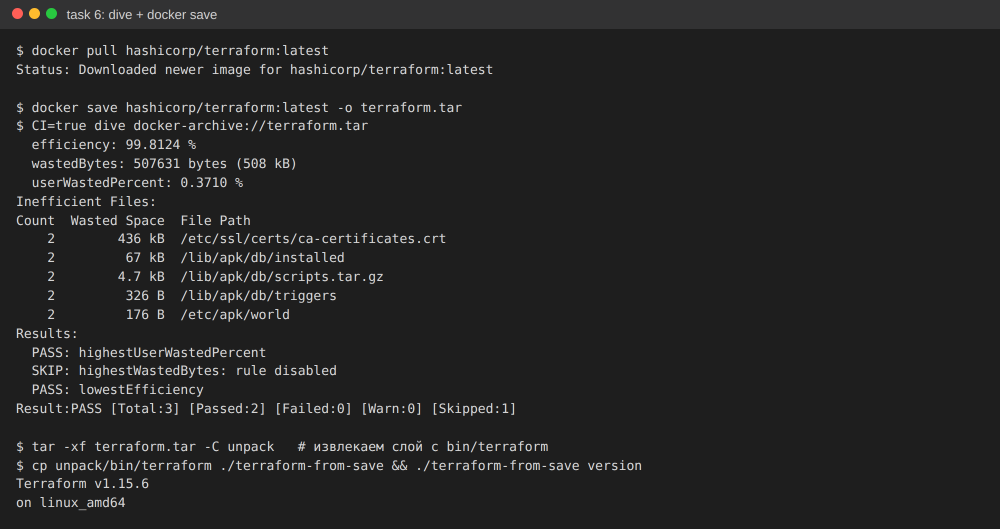
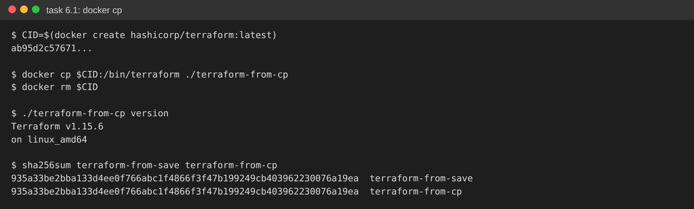

# Решение ДЗ «Практическое применение Docker»

Форк: `vpakspace/shvirtd-example-python`. Окружение: Ubuntu 24.04, Docker 29.x, `docker compose` v2.37.

Добавленные файлы: `Dockerfile.python`, `compose.yaml`, `.dockerignore`, `.gitignore`, `deploy.sh`.

---

## Задача 0. Проверка docker compose

```bash
$ docker-compose --version
Command 'docker-compose' not found       # legacy-версия НЕ установлена — верно

$ docker compose version
Docker Compose version v2.37.1            # плагин установлен, ≥ v2.24 — верно
```

---

## Задача 1. Dockerfile.python (multistage)

Создан [`Dockerfile.python`](Dockerfile.python) на базе `python:3.12-slim`, с обязательным `COPY . .`,
запуском через `uvicorn ... --port 5000` и **multistage**-сборкой (build-стадия ставит зависимости в
`/install`, runtime-стадия тащит только их + код). Лишнее исключено через [`.dockerignore`](.dockerignore).

```bash
$ docker build -f Dockerfile.python -t shvirtd-web:test .
Successfully tagged shvirtd-web:test      # образ ~267 MB
```

---

## Задача 3. compose.yaml (web + db + proxy)

[`compose.yaml`](compose.yaml) через `include` подключает `proxy.yaml` (nginx ingress + haproxy reverse)
и описывает:
- **web** — собирается из `Dockerfile.python`, сеть `backend`, фикс. IP `172.20.0.5`, `restart: on-failure`,
  ENV для подключения к MySQL (`DB_HOST=db`, остальное из `.env`);
- **db** — `mysql:8`, сеть `backend`, фикс. IP `172.20.0.10`, `restart: on-failure`, секреты из существующего `.env`.

Цепочка: **Клиент → Nginx (8090) → HAProxy (8080) → FastAPI (5000) → MySQL**.

```bash
$ docker compose up -d --build
$ curl -L http://127.0.0.1:8090
"TIME: 2026-06-12 01:16:09, IP: 127.0.0.1"
```

SQL-проверка (`show databases; use virtd; show tables; SELECT * from requests LIMIT 10;`):



После проверки проект остановлен: `docker compose down`.

---

## Задача 4. Деплой на облачную ВМ (Yandex Cloud)

ВМ в YC: 2 vCPU (core-fraction 20%), **2 ГБ RAM**, Ubuntu 22.04, внешний IP `84.252.129.148`, security
group открывает порты 22 и 8090.

```bash
$ ssh yc-user@84.252.129.148
$ docker-compose --version        # не установлен
$ curl -fsSL https://get.docker.com | sudo sh
$ docker compose version
Docker Compose version v2.x
```

Bash-скрипт [`deploy.sh`](deploy.sh) скачивает форк в `/opt` и поднимает проект целиком:

```bash
$ ./deploy.sh
>>> Клонирую репозиторий в /opt/shvirtd-example-python...
>>> docker compose up -d --build
NAME                ... STATUS
...-db-1            ... Up
...-ingress-proxy-1 ... Up
...-reverse-proxy-1 ... Up
...-web-1          ... Up
```

Проверка через **check-host.net** для `http://84.252.129.148:8090` — трафик идёт
`Пользователь → Internet → Nginx → HAProxy → FastAPI (запись в БД) → HAProxy → Nginx → Пользователь`.
Все узлы вернули **200 OK**:



SQL-запрос **на сервере**: в таблице `requests` видны IP узлов check-host.net
(Германия `116.203.22.31`, Литва `88.119.179.10`, Россия `185.130.104.238`, Турция `77.92.151.181`) —
подтверждение того, что запросы прошли всю прокси-цепочку и записались в БД:



Ссылка на форк: <https://github.com/vpakspace/shvirtd-example-python>

> Облачные ресурсы удалены после демонстрации (инструкция по экономии облачных средств).

---

## Задача 6. Извлечение бинаря terraform через dive + docker save

```bash
$ docker pull hashicorp/terraform:latest
$ docker save hashicorp/terraform:latest -o terraform.tar
$ CI=true dive docker-archive://terraform.tar      # анализ слоёв образа
$ tar -xf terraform.tar -C unpack                  # извлекаем слой с bin/terraform
$ cp unpack/bin/terraform ./terraform-from-save
$ ./terraform-from-save version
Terraform v1.15.6
```



---

## Задача 6.1. Тот же результат через docker cp

```bash
$ CID=$(docker create hashicorp/terraform:latest)
$ docker cp "$CID":/bin/terraform ./terraform-from-cp
$ docker rm "$CID"
$ ./terraform-from-cp version
Terraform v1.15.6
$ sha256sum terraform-from-save terraform-from-cp   # хеши совпадают
```


